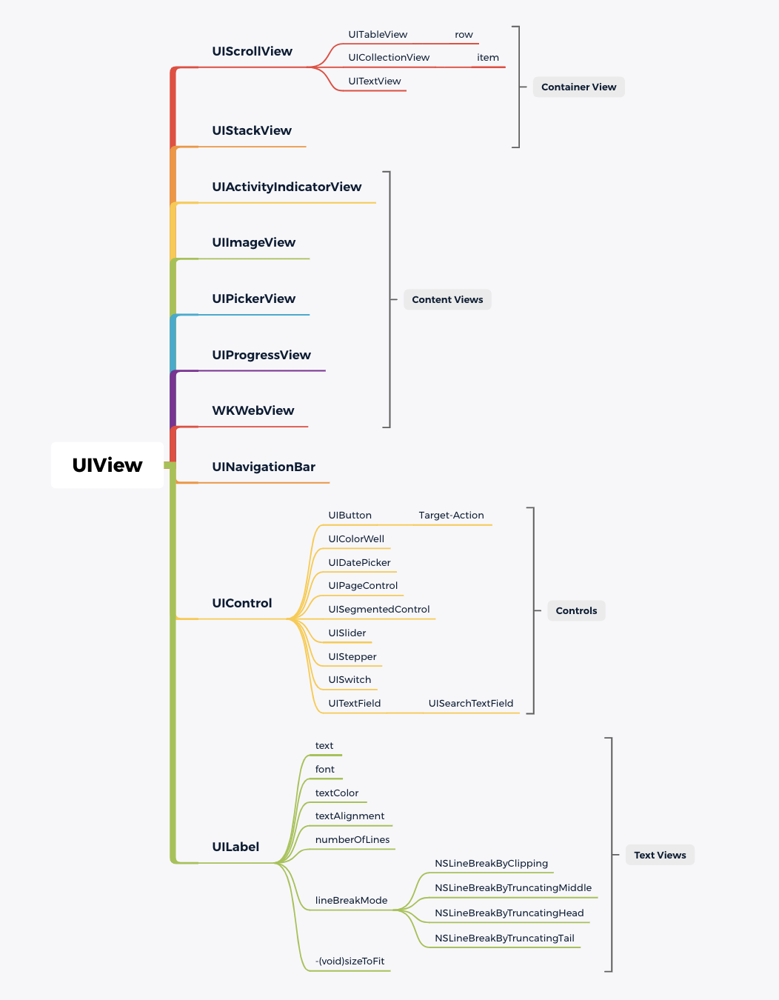

## UIKit

### UIView



- **Create a UIView object**

```objective-c
// ViewController.m
UIView *firstView = [[UIView alloc]init];						//Step1
firstView.backgroundColor = [UIColor orangeColor];       		//Step2
firstView.frame = CGRectMake(self.view.bounds.origin.x, self.view.bounds.origin.y, self.view.bounds.size.width, self.view.bounds.size.height);  
[self.view addSubview:firstView];								//Step3
```

